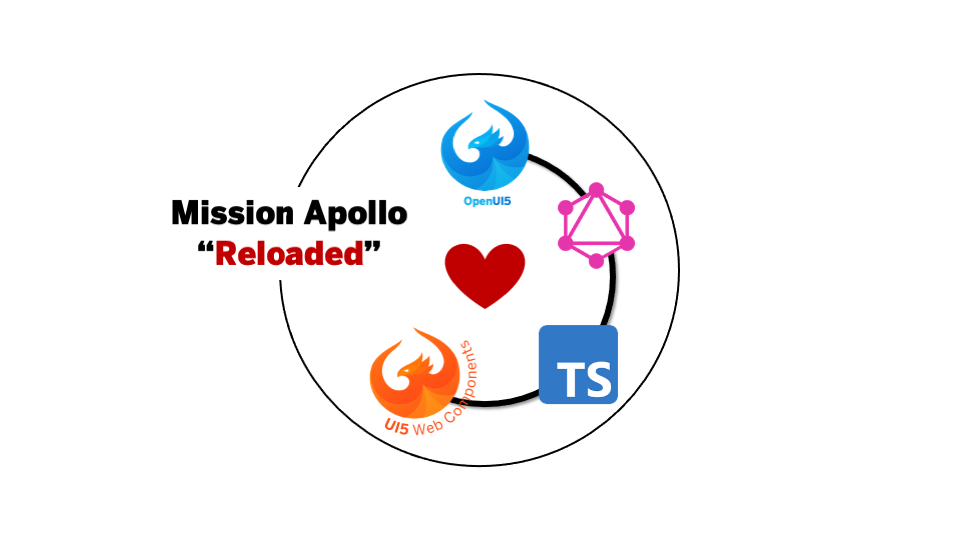

# ui5-sample-apollo-reloaded

> After a successful Mission Apollo in 2020 ([GitHub](https://github.com/petermuessig/ui5-sample-apollo), [Recording](https://www.youtube.com/watch?v=r1XChmnI5gw)), once again a brave mission has been started to combine the latest available technologies around the UI5 ecosystem with Apollo GraphQL: *Mission Apollo Reloaded*



> Are TypeScript, OpenUI5, UI5 Web Components and Apollo GraphQL falling in love? Yes, they definitely do!

## Overview

> **DISCLAIMER**: Although, the project has been created by SAP developers, there is no warrenty or guarantee that the project follows best practices or official recommendations! The project serves for inspiration!

This project show-cases the usage of [Apollo GraphQL](https://www.apollographql.com/) for [TypeScript](https://www.typescriptlang.org/)-based UI5 applications. The goal of this project is to show-case the consumption of the Apollo GraphQL library directly via **`import` statement** and benefit from the **code completion** support of TypeScript.

Supporting OSS libraries *native* in TypeScript UI5 applications is challanging as the `import` statements of ES modules are converted into `sap.ui.define` statements. Although, Apollo GraphQL is imported as ES module, at runtime it is loaded as a `sap.ui.define` AMD-like module in the UI5 runtime.

This requires a special treatment of the OSS libraries loaded from `node_modules`. The [UI5 tooling](https://sap.github.io/ui5-tooling/) in general supports [*shimming*](https://sap.github.io/ui5-tooling/pages/Configuration/#extension-configuration) to consume OSS libraries directly from [npm](https://www.npmjs.com/). Unfortunately, these OSS libraries need to be client-side modules which can be consumed without transpiling. The `ui5-sample-apollo-reloaded` project makes use of the `ui5-tooling-modules` custom middleware and task. The tooling extensions enable the consumption of OSS libraries from `node_modules` and make them available as `sap.ui.define` AMD-like modules. Technically, the middleware and the task are using [rollup](https://rollupjs.org/) to create bundles for the `import`s or `sap.ui.define` AMD-like modules.

Besides the consumption of the Apollo GraphQL dependencies, the sample also show-cases the usage of these dependencies in the UI5 programming model. The sample includes a UI5 library which defines a `BaseController` to simplify the usage of GraphQL for UI5 applications. The `BaseController` reads the GraphQL datasource from the `manifest.json` and enables support for the `apollo` object. The `apollo` object simplifies the consumption of a graph in UI5. The graph will be stored in a one-way `JSONModel` which can be used to bind the UI elements against it.

The UI5 application is using an unidirectional data flow. The `JSONModel` keeps the client-side state. The UI elements of the `XMLView` are bound to the `JSONModel` using one-way binding. The `Controller` listens to the events of the UI elements and takes care to forward the changes to the Apollo server via a `mutation`. Afterwards, the client-side gets notified by `subscriptions` and update the `JSONModel`.

The session is being inspired by the original session at the UI5Con on Air 2020 and was presented as part of a lightning talk. [The recording can be found on YouTube](https://www.youtube.com/watch?v=r1XChmnI5gw) and the source code can be found on [GitHub](https://github.com/petermuessig/ui5-sample-apollo).

## Repository Structure

The `ui5-sample-apollo-reloaded` repository has been setup as a monorepo using `yarn` workspaces. Instead of `npm` you need `yarn` to run the project. You can use the [yarn installation page](https://classic.yarnpkg.com/en/docs/install) or install `yarn` via `npm`:

```bash
# Install yarn (if not done already)
npm i -g yarn
```

The repository includes the Apollo GraphQL server, a custom task and middleware extension for the UI5 Tooling, a TypeScript-based UI5 library including the Apollo `BaseController` and a TypeScript-based UI5 todo application:

```text
packages
├── apollo-demo-todo-server // the Apollo GraphQL server
├── apollo-demo-todo-app    // the UI5 application
└── apollo-demo-todo-lib    // the UI5 library (INFO: dashes are only used for the package name, not for the library namespace!)
```

## Get Started

To get started with the monorepo, please ensure to run `yarn` once to install all required dependencies in your `node_modules` folder:

```bash
# install dependencies
yarn

# run the project (starts the GraphQL and UI5 server)
yarn start
```

The start script will run the Apollo GraphQL server, the UI5 development server and Babel in the watch mode for the TypeScript-based projects: `apollo.demo.todo.app` and `apollo.demo.todo.lib`.

To create and run the production build of the monorepo, just run the following command:

```bash
# build the project
yarn build

# run the built project
yarn dist
```

In `packages/apollo.demo.todo.app/dist` folder you can find the build result of UI5 application and related libraries. The `dist` folder contains the application, the libraries and the bundles for the used OSS libraries.

## Using npm packages in UI5

The goal of the repository is to show the consumption of npm packages as dependency in the `package.json` and at runtime as ES module `import`. The ES module `import` also enables proper code completion.

1. Adding the npm package as dev dependency:

    ```sh
    npm install @apollo/client -D

    yarn add @apollo/client -D
    ```

2. Import the dependency at runtime:

    ```ts
    // ES module import
    import { ApolloClient, gql } from "@apollo/client/core";
    ```

    ```js
    // UI5s AMD-like syntax
    sap.ui.define([
      "@apollo/client/core"
    ], function(ApolloClientCore) {

        const { ApolloClient, gql } = ApolloClientCore;

    });;
    ```

    > **Remark**: the `tsconfig.json` must use `"moduleResolution": "Node"` to be able to provide code completion for npm packages.

3. Using the `ui5-tooling-modules` to consume npm packages at runtime:

    ```yaml
    [...]

    builder:
      customTasks:
      - name: ui5-tooling-modules-task
        afterTask: replaceVersion
    server:
      customMiddleware:
      - name: ui5-tooling-modules-middleware
        afterMiddleware: compression

    [...]
    ```

The `ui5-tooling-modules` extensions provides a custom middleware and a custom task which detects dependencies to npm packages and creates a bundle for each dependency.

## Using Apollo GraphQL in UI5

To improve the usage of Apollo GraphQL within TypeScript-based UI5 applications, the `apollo.demo.todo.lib` provides a `BaseController` implementation which is adding some *syntactic sugar* to work easily with GraphQL and manages the GraphQL data in a
`JSONModel`. This allows the usage of simple databinding in the `XMLView` to connect the GraphQL data with the UI5 controls.
This `Controller` is the [`apollo/demo/todo/lib/controller/BaseController`](packages/apollo.demo.todo.lib/src/apollo/demo/todo/lib/controller/BaseController.ts).

Let's take a look into the functionality provided by the `BaseController`:

```ts
  public onInit(): void {
    this.client = new ApolloClient({
      [...]
    });

    // some syntactic sugar for the consumers
    this.$query = this.client.query.bind(this.client);
    this.$mutate = this.client.mutate.bind(this.client);
    this.$subscribe = this.client.subscribe.bind(this.client);

    // create a one-way JSONModel for the data (as a "store")
    const model = new JSONModel();
    model.setDefaultBindingMode(BindingMode.OneWay);
    this.getView().setModel(model);

    // enrich the apollo object (add invoke functions)
    if (this.apollo) {
      Object.keys(this.apollo).forEach((entity) => {
        this.apollo[entity].invoke = () => {
          this.invoke(entity);
        };
        if (!this.apollo[entity].skip) {
          this.invoke(entity);
        }
      });
    }
  }
```

The `BaseController` creates the `ApolloClient` instance based on the datasource configuration in the `manifest.json`:

```json
    "dataSources": {
      "gqlsvc": {
        "uri": "http://localhost:4000/graphql",
        "customType": true,
        "type": "GraphQL",
        "settings": {
          "ws": "ws://localhost:4000/graphql"
        }
      }
    }
```

In addition, the `BaseController` adds some shortcuts to `$query`, `$mutate` and `$subscribe` (the *syntactic sugar*). It creates a standard `JSONModel` to manage the GraphQL data. The last step during the initialization is to look over the so called Apollo root object and enrich the defined entities with an `invoke` function as well as calling the `invoke` directly if the property `skip` is not `true`:

```ts
/**
 * @namespace apollo.demo.todo.app.controller
 */
export default class AppController extends BaseController {
  apollo = {
    todos: {
      binding: "{/todos}",
      query: gql`
        query GetToDos {
          todos {
            id
            title
            completed
          }
        }
      `,
    },
  };
```

This declaration will trigger a query to request the `todos` with the attributes `id`, `title` and `completed` and put them into the `JSONModel` with the path `/todos`. This allows to access and bind the todos within the `XMLView` with the databinding syntax:

```xml
<List items="{/todos}">
    <CustomListItem class="todoItems">
        <CheckBox checked="{completed}" change=".completeTodo"/>
        <Label text="{title}"/>
        <Button icon="edit" click=".editTodo"/>
        <Button icon="delete" design="Negative" click=".deleteTodo"/>
    </CustomListItem>
</List>
```

## Background Information

The project has been created using the [easy-ui5](https://github.com/SAP/generator-easy-ui5) generator by using the [generator-ui5-ts-app](https://github.com/ui5-community/generator-ui5-ts-app).

The `tsconfig.json` needs to be adopted to provide code completion for npm packages and to enable support for the UI5 library and UI5 application namespaces:

```json
{
    "compilerOptions": {
        [...]
        "moduleResolution": "Node",
        [...]
        "typeRoots": [
            "../../node_modules/@types",
            "../../node_modules/@openui5/ts-types-esm"
        ],
        "paths": {
            "sap/ui/demo/apollo/*": [
                "./src/*"
            ],
            "apollo/demo/todo/lib/*": [
                "../../node_modules/apollo.demo.todo.lib/src/apollo/demo/todo/lib/*"
            ]
        }
    },
    "include": [
        "./src/**/*"
    ]
}
```

1. The `moduleResolution` must be set to `Node` to include npm packages.
2. The `typeRoots` must define `@types` and `@openui5/ts-types-esm` to provide code completion for DefinitelyTyped type definitions and OpenUI5.
3. The `paths` must include the namespaces for the UI5 application and the related UI5 libraries.

All these configurations are necessary that the IDE (e.g. VSCode) provides code completion support for the OSS libraries, OpenUI5, the UI5 library sources and the UI5 application.

### Remarks

For the namespace of the UI5 library, we used `apollo.demo.todo.lib`. A namespace with dashes works but has some downsides while accessing the resources from the global namespace.

## How to obtain support

Please use the GitHub bug tracking system to post questions, bug reports or to create pull requests.

## Contributing

Any type of contribution (code contributions, pull requests, issues) to this showcase will be equally appreciated.

## License

This work is [dual-licensed](LICENSE) under Apache 2.0 and the *Derived Beer-ware License*. The official license will be Apache 2.0 but finally you can choose between one of them if you use this work.

When you like this stuff, buy [@DamianMaring](https://twitter.com/DamianMaring) a beer or buy [@pmuessig](https://twitter.com/pmuessig) a coke.
